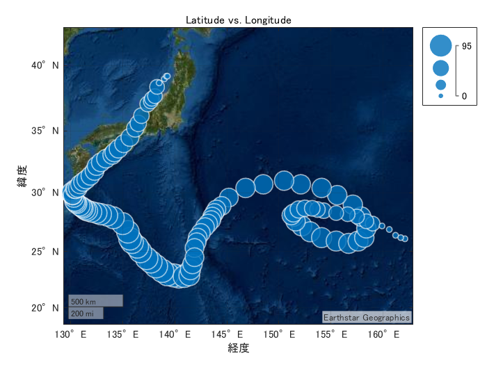
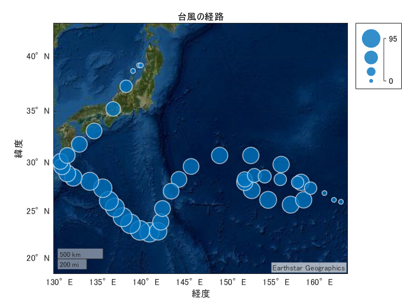
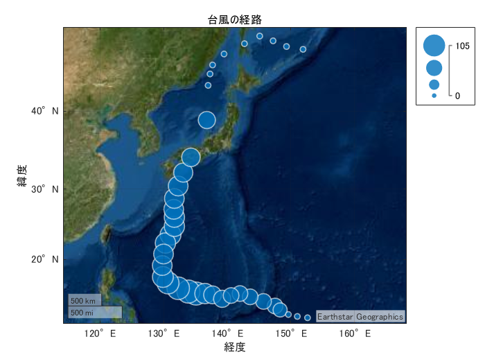

# Part 1: 台風経路の可視化

Copyright 2022 The MathWorks, Inc

使用する data_NORU.csv と data_HALONG.csv のデータは気象庁のページから入手したものを元にしています。

[https://www.jma.go.jp/jma/jma-eng/jma-center/rsmc-hp-pub-eg/Besttracks/e_format_bst.html](https://www.jma.go.jp/jma/jma-eng/jma-center/rsmc-hp-pub-eg/Besttracks/e_format_bst.html)

# NORU の経路

インポートツールから自動生成した読み込み関数 `importfile` を使用します。

```matlab:Code
dataNORU = importfile('data_NORU.csv');
```

「プロットの作成」タスクを使って可視化

```matlab:Code
% 作成 dataNORU.Latitude と dataNORU.Longitude の geobubble
gb = geobubble(dataNORU.Latitude,dataNORU.Longitude,dataNORU.WindSpeed,'Basemap','satellite');

% 追加 title
title('Latitude vs. Longitude')
```



時系列データの間隔が 3 hours/ 6 hours 混在なので、timetable 型に変換後に retime 使用して間隔を統一する処理を行って再度プロット

```matlab:Code(Display)
tData_NORU = table2timetable(dataNORU);
% timetable の時間再調整
newTimetable = retime(tData_NORU(:,[1 3 4 5 6 7]),"regular","linear",...
    "TimeStep",hours(12));

% 各オーバーライド変数を同じ時間ベクトルに時間調整
TT = retime(tData_NORU(:,"Name"),newTimetable.Properties.RowTimes,"previous");
newTimetable = addvars(newTimetable,TT.(1),'Before',2,...
    'NewVariableNames',"Name");
clear TT

gb = geobubble(newTimetable.Latitude,newTimetable.Longitude,newTimetable.WindSpeed,'Basemap','satellite');

title('台風の経路')
```

ここまでのコードは「リファクター」機能を用いて `plotTracks` としてローカル関数化（スクリプト下部参照）

```matlab:Code
plotTracks(dataNORU);
```



# HALONG の経路

データ読み込みから可視化までの道具が揃ったので別の台風データについても同様に処理。

```matlab:Code
data_HALONG = importfile('data_HALONG.csv');
plotTracks(data_HALONG)
```



# ローカル関数

```matlab:Code
function plotTracks(dataNORU)
tData_NORU = table2timetable(dataNORU);
% timetable の時間再調整
newTimetable = retime(tData_NORU(:,[1 3 4 5 6 7]),"regular","linear",...
    "TimeStep",hours(12));

% 各オーバーライド変数を同じ時間ベクトルに時間調整
TT = retime(tData_NORU(:,"Name"),newTimetable.Properties.RowTimes,"previous");
newTimetable = addvars(newTimetable,TT.(1),'Before',2,...
    'NewVariableNames',"Name");
clear TT

gb = geobubble(newTimetable.Latitude,newTimetable.Longitude,newTimetable.WindSpeed,'Basemap','satellite');

title('台風の経路')
end
```
