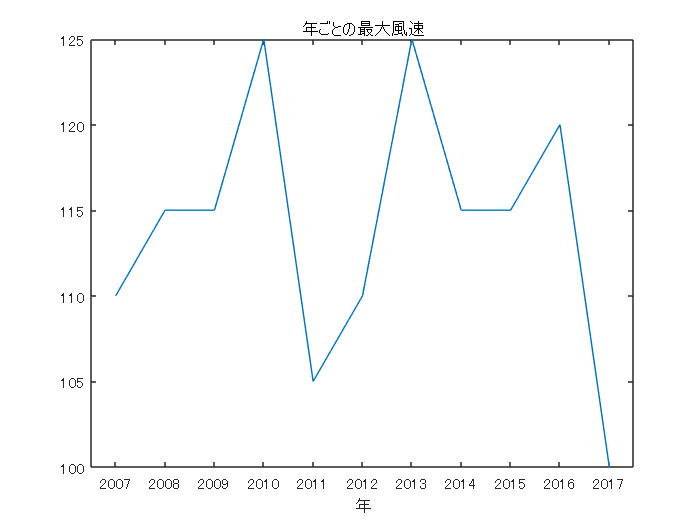
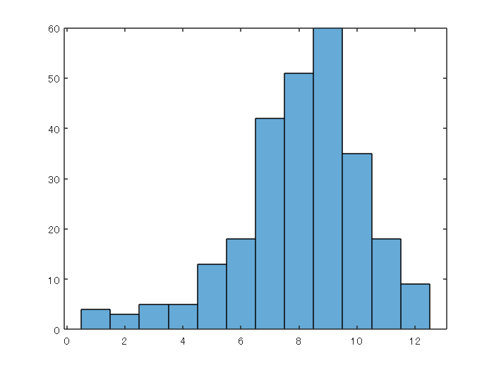
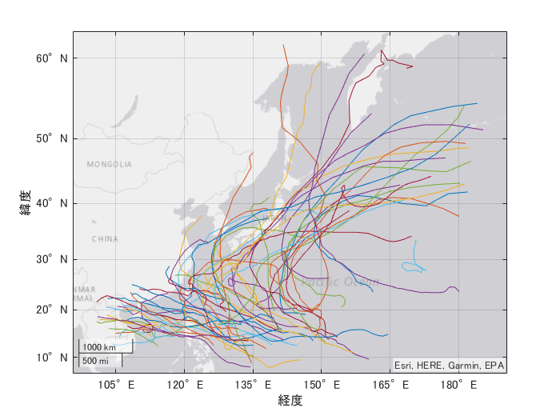

# Part2: 過去台風データの分析

Copyright 2022 The MathWorks, Inc

ドキュメンテーションの「[地理密度プロットでの台風の軌跡データの表示](https://jp.mathworks.com/help/matlab/creating_plots/view-cyclone-track-data-in-geographic-density-plot.html)」で紹介されているデータを使用します。

```matlab:Code
load cycloneTracks
data = cycloneTracks;
```

もし data_NORU.csv と同様に台風毎にデータが個別に用意されている場合は、`datastore` を使用した以下の方法で全部読み込むことができます。以下では全ファイルが dataset というフォルダ内に保存されている想定です。

```matlab:Code(Display)
ds = datastore('dataset')
data = readall(ds);
data.Time = datetime(data.Time); % 日付データは文字列として読み込まれるので datetime 型に変換
```

# 台風のグレード毎の気圧値

データでは以下の区分けで、その時々の Grade がついています。

   -  2 : Tropical Depression (TD) 
   -  3 : Tropical Storm (TS) 
   -  4 : Severe Tropical Storm (STS) 
   -  5 : Typhoon (TY) 
   -  6 : Extra-tropical Cyclone (L) 
   -  7 : Just entering into the responsible area of RSMC Tokyo-Typhoon Center 
   -  8 : Not used 
   -  9 : Tropical Cyclone of TS intensity or higher 

ここでは Grade 毎に気圧値（Pressure) がどのような値を持つかを調べます。

```matlab:Code
% グループ要約の計算
newTable = groupsummary(data,"Grade",["median","min"],"Pressure");
newTable.GroupCount = []
```

| |Grade|median_Pressure|min_Pressure|
|:--:|:--:|:--:|:--:|
|1|2|1004|990|
|2|3|994|980|
|3|4|980|965|
|4|5|950|885|
|5|6|996|948|
|6|7|993|945|

最も台風が発達した状態（Grade = 5）で気圧が最も低く直感とも合うことが分かります。

# 最大風速の変化

その年に発生した台風の最大風速がどのように変化しているかを見てみます。

```matlab:Code
% グループ要約の計算
newTable2 = groupsummary(data,"Time","year","max","WindSpeed");
newTable2.GroupCount = []
```

| |year_Time|max_WindSpeed|
|:--:|:--:|:--:|
|1|2007|110|
|2|2008|115|
|3|2009|115|
|4|2010|125|
|5|2011|105|
|6|2012|110|
|7|2013|125|
|8|2014|115|
|9|2015|115|
|10|2016|120|
|11|2017|100|

変化をプロットしてみると、2007年 - 2017年では傾向は見られません。

```matlab:Code
plot(newTable2.year_Time,newTable2.max_WindSpeed)

title('年ごとの最大風速')
xlabel('年')
```



# 月ごとの発生回数

月ごとの台風発生回数を集計します。`month(x(1))` というカスタム関数で集計していますが、これは台風の最初の情報の時点での月をその台風の発生月と定義しています。

```matlab:Code
% グループ要約の計算
newTable3 = groupsummary(data,"ID",@(x) month(x(1)),"Time");
newTable3.GroupCount = [];
```

ヒストグラム化してみるとこちらも経験にあっており、7月 - 9月に台風が増加していることが見て取れます。

```matlab:Code
histogram(newTable3.fun1_Time)
```



# 月ごとの経路の違い

月ごとの経路の違いを可視化します。for ループ内で `drawnow` を使うことでアニメーションを作成します。そのまま動画（mp4, gif）として出力可能です。

```matlab:Code
month2show = 9;
idx = newTable3.fun1_Time == month2show;
ID2show = newTable3.ID(idx);

subdata = data(ismember(data.ID,ID2show),:);

uniqueID = unique(subdata.ID,'stable');
for ii = 1:length(uniqueID)
    tmp = subdata(subdata.ID == uniqueID(ii),:);
    geoplot(tmp.Latitude, tmp.Longitude)
    hold on 
    drawnow
end
hold off
```


